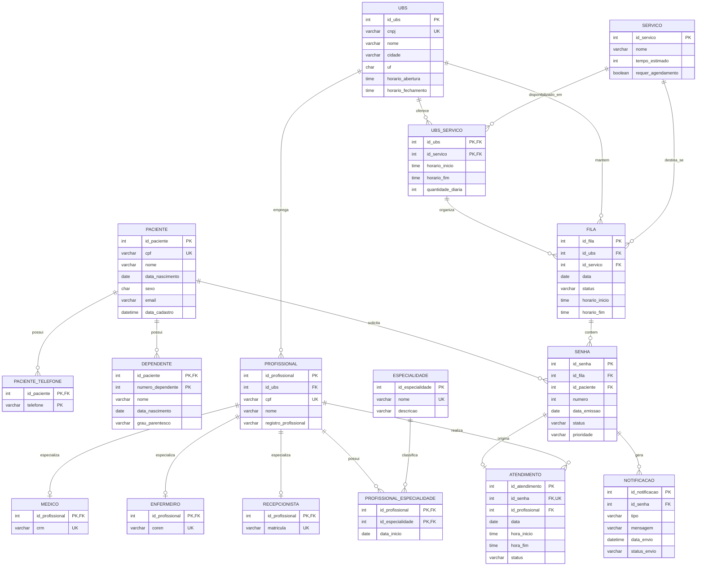

# Visão relacional do banco

Este diagrama foi derivado do arquivo [`fila-ja.sql`](../sql/fila-ja.sql) para permitir a leitura da estrutura diretamente no GitHub. Ele é apenas um complemento, não serve para substituir os modelos conceitual e lógico.

